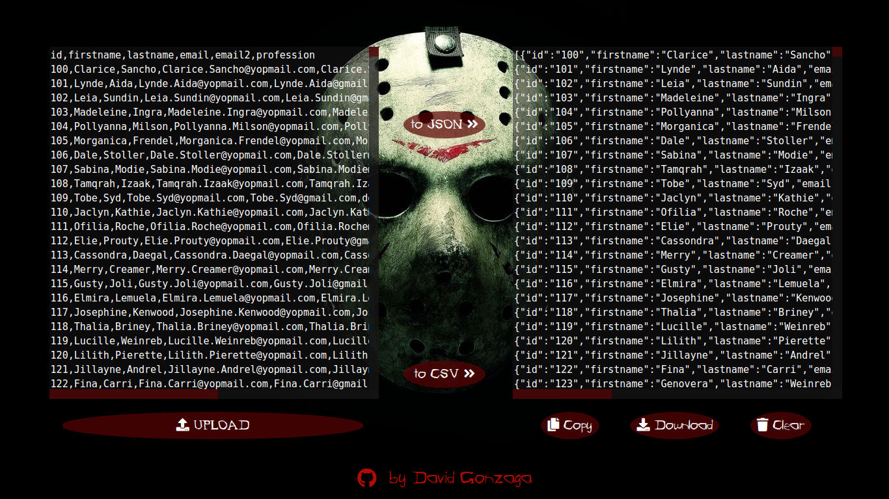

# CSV to JSON {" "}

## Projeto de iniciativa pessoal, onde o usuário pode converter arquivos no formato csv para json e json  para csv. Permite que seja feito upload do arquivo para a conversão e o download do arquivo convertido.

##   

Acesse a <a href="https://gonzagadavid.github.io/linear-gradient-CSS/" target="_blank" >Página do Projeto</a>

### Se gostou não se esqueça da :star: motivacional :grimacing: 

